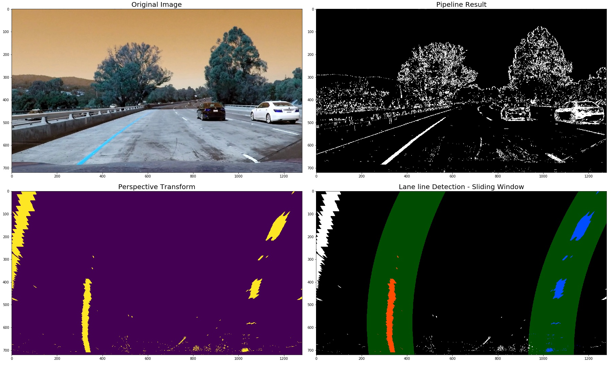
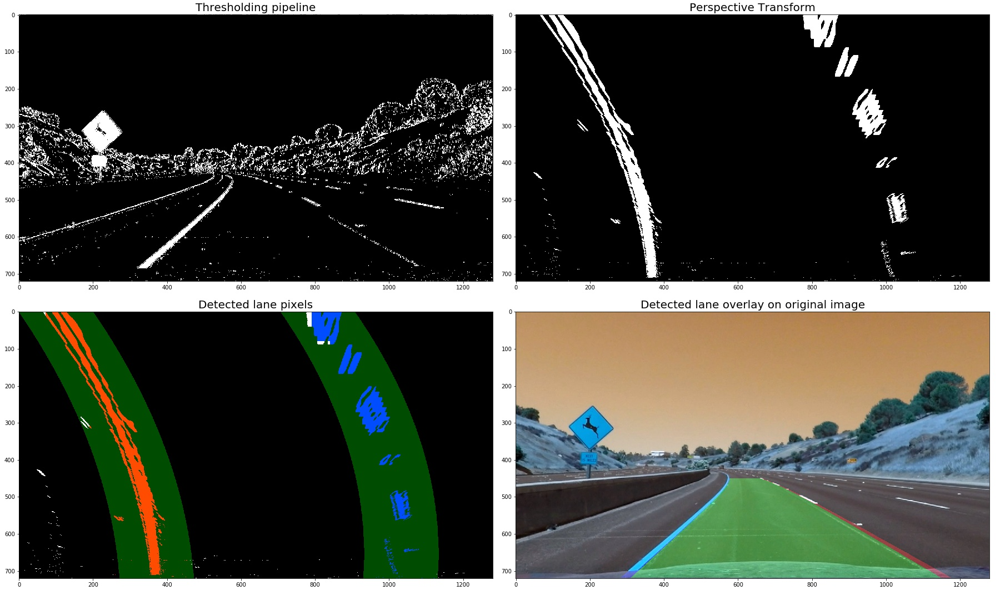
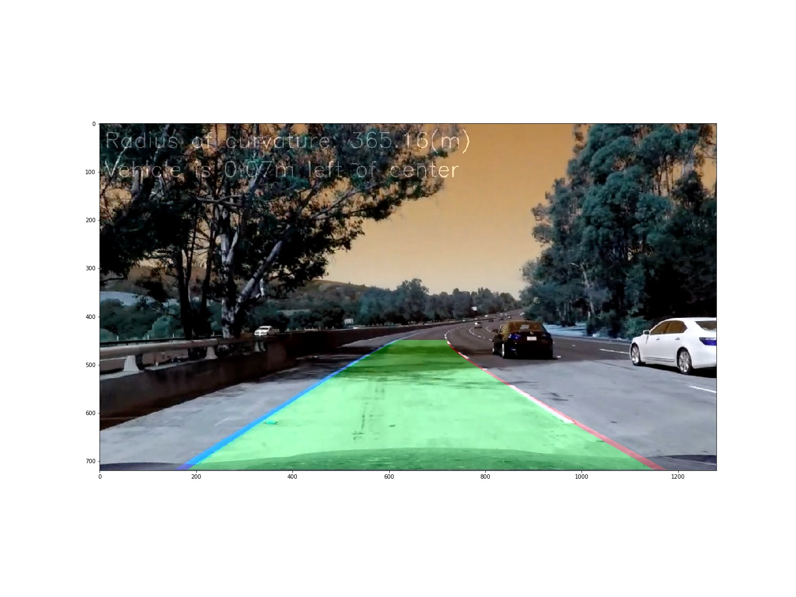

**Advanced Lane Finding Project**

The goals / steps of this project are the following:

* Compute the camera calibration matrix and distortion coefficients given a set of chessboard images.
* Apply a distortion correction to raw images.
* Use color transforms, gradients, etc., to create a thresholded binary image.
* Apply a perspective transform to rectify binary image ("birds-eye view").
* Detect lane pixels and fit to find the lane boundary.
* Determine the curvature of the lane and vehicle position with respect to center.
* Warp the detected lane boundaries back onto the original image.
* Output visual display of the lane boundaries and numerical estimation of lane curvature and vehicle position.

NOTE: One can use the `RunOnVideos.ipynb` notebook to run the lane detection code on video inputs.

### Camera Calibration

The code for this step is contained in the method `calibrate_camera` (lines 31 to 56) in the file `lane_detector.py`.

The given set of sample chessboard images have 9 corners column-wise and 6 corners row-wise. 
I start by preparing "object points", which will be the (x, y, z) coordinates of the chessboard corners in the world. Here I am assuming the chessboard is fixed on the (x, y) plane at z=0, such that the object points are the same for each calibration image.  Thus, `objp` is just a replicated array of coordinates, and `objpoints` will be appended with a copy of it every time I successfully detect all chessboard corners in a test image.  `imgpoints` will be appended with the (x, y) pixel position of each of the corners in the image plane with each successful chessboard detection.  

I then used the output `objpoints` and `imgpoints` to compute the camera calibration and distortion coefficients using the `cv2.calibrateCamera()` function.  I applied this distortion correction to the test image using the `cv2.undistort()` function and obtained this result: 

I store the distortion co-effecients  and the camera matrix to be applied to the images from the drive.

### Pipeline (single images)

#### 1. An example of a distortion-corrected image.

I read the image into an array, and apply the `cv2.undistort()` function with `distortion co-effecients` and `camera matrix` computed in the first step. Following is an example of an image, before and after applying the `cv2.undistort()` function:

#### 2. Color transforms, gradients or other methods to create a thresholded binary image.

I used a combination of color and gradient thresholds to generate a binary image (thresholding steps at lines 58 through 85 in `lane_detector.py`).  At first, I transformed the images to gray space and applied Sobel operator and took the derivative along the x axis and applied thresholding. Then I transformed the images to HLS color space and picked the S channel and applied thresholding. Finally I combined the results of both these methods to obtain the final binary image.

Here's an example of my output for this step. 

#### 3. Perspective transform

The code for my perspective transform includes a function called `corners_unwarp()`, which appears in lines 87 through 103 in the file `lane_detector.py`.  The `corners_unwarp()` function takes as inputs an image (`img`), as well as camera matrix (`mtx`) and distortion co-efficients (`dist`).  I chose the hardcode the source and destination points form the top left to bottom left, clockwise:

| Source        | Destination   | 
|:-------------:|:-------------:| 
| 600, 450      | 300, 0        | 
| 685, 450      | 980, 0      |
| 1100, 720     | 980, 720      |
| 200, 720      | 360, 720        |

I verified that my perspective transform was working as expected by drawing the `src` and `dst` points onto a test image and its warped counterpart to verify that the lines appear parallel in the warped image.

#### 4. Identify lane-line pixels and fit their positions with a polynomial

After having applied the perpective transform, I tried 2 methods to detect the lane pixels in the images. In the first method, I sliced the images horizontal sections and for each section applied convolution on a small window, across the section. Then identified the regions of lane lines with regions of high pixel values. With these pixel value postions, I fitted a polynomial using the `np.polyfit()` function. Using the co-effcients from the result, I computed the `x` values for given `y` poistion (0 to image height). The application of this technique can be visualized as follows:

However, this method had some shortcomings. The technique worked for most parts of the project video, but had problems when there was different lighting conditions on the road and when the lane lines were discontinous. This issue can be visualized as follows:

Technique 1 in code is in the IPython Notebook (./AdvanceLandDetectionTechniques.ipynb) in code blocks 63, 64 and 65.

Then I resorted to the `sliding window` technique which was explained in the lectures. This technique also involved slicin the images and finding the high pixel value regions. However, for me this technique worked way better than the `convolution` technique. Also, used the already detected high pixel value regions from the previous frames to look for the high pixel regions in the new frame.

Following visualization illustrated the result of sliding window technique.

The code for this technique can be found in the method `detect_lane_pixels_sw()` in file `lane_detector.py` (lines 106 through 196) 

#### 5. Calculate the radius of curvature of the lane and the position of the vehicle with respect to center.

I did this in lines 240 through 251 in my code in `lane_detector.py`. I computed the left and right lane line curvature separetly using the `np.polyfit()` function and with x and y values converted from pixel space to real world space (meters). I calculated the position of the car as a difference between the center of the image (vehicle center) and the midpoint of the lane (lane center).

#### 6. An example image of the result plotted back down onto the road

I implemented this step in lines 274 through 294 in my code in `lane_detector.py` in the function `draw_lane_path()`.  Here is an example of my result on a test image:

Visualization of end to end pipeline of the above describe steps can be visualized as follows:

Finally an example of the image with text annotations:

---

### Pipeline (video)

Here's a [link to my video result](./output_videos/project_video_output.mp4)

---

### Discussion

#### 1. Briefly discuss any problems / issues you faced in your implementation of this project.  Where will your pipeline likely fail?  What could you do to make it more robust?

Challenges:

1. Convolution technique for lane pixel detection did not work as expected. Hence used the sliding window technique.

2. Used the values from previous (n frames) to compute weight average for fitted `x` values however did not observe any considerable improvement. 

Issues:

1. Camera calibration is a very important step in order to apply the given set of the techniques or pipeline to detect lanes. That means, if we do not have images necessary for calibrating the camera (chessbaord images) then we cannot apply these techniques properly. Hence the pipeline is not generic.

2. Some parts of the code, for instance `perspective transform` has hard coded values and hence not generic.

3. The thresholding values for color and gradient transforms are hard coded and might not generalize to images with different features or for images from different cameras.

4. Although I have considered the values from previous frames to identify lane lines in the current frame, the approach can be better. 
